# Dance Yard Studio Website – Technical Specification

| | |
|---|---|
| **Status** | Draft v0.1 – describes the code on `main` as of commit `9d35df4` |
| **Date** | 2026-10-01 |
| **Owner** | @surajrahade27 |
| **Related** | [Client questionnaire](../functional-spec/client-questionnaire.md) · [Client profile](../functional-spec/client-profile-danceyard.md) · [README](../../README.md) |

> Diagrams are written in [Mermaid](https://mermaid.js.org/). GitHub renders them automatically. In VS Code, install a Mermaid preview extension (for example *Markdown Preview Mermaid Support*) to see them in the Markdown preview.

## Contents

1. [Introduction](#1-introduction)
2. [Requirements summary](#2-requirements-summary)
3. [High-level design](#3-high-level-design)
4. [Low-level design](#4-low-level-design)
5. [Cross-cutting concerns](#5-cross-cutting-concerns)
6. [Environments and operations](#6-environments-and-operations)
7. [Testing strategy](#7-testing-strategy)
8. [Known gaps, risks and recommendations](#8-known-gaps-risks-and-recommendations)
9. [Open questions](#9-open-questions)
10. [Future roadmap](#10-future-roadmap)
11. [Appendix A – Decision log](#appendix-a--decision-log)
12. [Appendix B – Content recipes](#appendix-b--content-recipes)

---

## 1. Introduction

### 1.1 Purpose

This document describes how the Dance Yard Studio portfolio website is built, deployed and run. It covers the overall architecture (high-level design), the modules, data, state and feature flows (low-level design), and the security, performance, accessibility, testing and operational concerns around them.

### 1.2 Scope

**In scope:** the public marketing website for Dance Yard Studio, Hinjewadi Phase 3, Pune: a single-page homepage, a privacy page and a 404 page, the enquiry form, and the CI/CD pipeline that ships it.

**Out of scope:** the separate Dance Yard platform (admin web app and Android app: logins, admissions, fees, attendance, ticketing, choreography booking management and so on). See [questionnaire §29](../functional-spec/client-questionnaire.md#29-features-not-included-in-the-portfolio). The website may *showcase* that platform later but never re-implements authenticated features.

### 1.3 Audience

Developers building and maintaining the site, and reviewers approving releases. §3 is readable without knowing the codebase; §4 onwards assumes familiarity with React.

### 1.4 Glossary

| Term | Meaning |
|---|---|
| **Section** | One block of the homepage (Hero, Classes, Gallery, …), a component in `src/sections/`. |
| **Grade** | A site-wide colour theme (Cinematic, Disco, Neon, Noir) that re-tints accents and photos. |
| **Graded image** | A photo shown through the grade's filter and tint (`.graded` in `global.css`). |
| **Reveal** | Entrance animation that plays once when an element scrolls into view. |
| **Deploy preview** | A temporary Netlify URL built from a pull request: `pr-<N>--<site>.netlify.app`. |
| **Honeypot** | A hidden form field (`bot-field`) that people leave empty and bots fill in. |
| **Facade** | A lightweight thumbnail shown in place of a heavy embed (YouTube) until the visitor clicks. |
| **Content files** | `src/data/danceyard.json` (all text) and `src/data/photos.json` (photo catalogue). |

---

## 2. Requirements summary

### 2.1 Functional requirements traceability

From the questionnaire's [Must Have](../functional-spec/client-questionnaire.md#27-website-features--final-selection) and [Nice-to-Have](../functional-spec/client-questionnaire.md#28-nice-to-have-features) lists.

| Requirement | Status | Implementation |
|---|---|---|
| Responsive, mobile-first UI | Done | Fluid `.container`, CSS Modules with breakpoints, mobile menu, sticky mobile CTA bar |
| Home page | Done | `pages/HomePage.jsx` – 17 sections on one page |
| About | Done (section) | `sections/About.jsx` – a homepage section, not a separate page |
| Classes | Done (section) | `sections/Programs.jsx` (anchor `#classes`) with audience filter |
| Choreography | Done (section) | `sections/Choreography.jsx` with WhatsApp booking CTA |
| Events | Done (section) | `sections/Events.jsx` – event cards with WhatsApp "Get details" |
| Gallery + lightbox | Done | `sections/Gallery.jsx` + `components/common/Lightbox.jsx`, category filters |
| YouTube video section | Done | `sections/Videos.jsx` + shared modal player (`VideoProvider`, `VideoModal`) |
| Testimonials | Done (placeholder content) | `sections/Testimonials.jsx` – autoplay carousel |
| FAQ | Done | `sections/Faq.jsx` – accordion |
| Contact + Google Maps | Done | `sections/Contact.jsx` – contact cards and map embed |
| Enquiry form | Done | `sections/Join.jsx` → Netlify Forms |
| WhatsApp CTA | Done | Floating button, mobile bar, header menu, cards, footer, form fallback |
| Click-to-call | Done, number **to confirm** | `tel:` links in Contact and Footer |
| Social links | Done (Instagram) | Header, Footer, Contact. Facebook/YouTube pending from client |
| SEO metadata | Partial | Title, description, Open Graph, JSON-LD in `index.html`. No `og:image`, canonical or sitemap yet |
| Favicon | Done (placeholder) | `public/favicon.svg` |
| 404 page | Done | `pages/NotFoundPage.jsx` (HTTP status is still 200 – see §8) |
| Privacy policy | Draft | `pages/PrivacyPage.jsx` – wording needs client/legal approval |
| Terms & Conditions | Not started | Waiting on client decision |
| Scroll animations, animated stats | Done | `Reveal`, `CountUp`, `SplitText`, CSS scroll-driven animations |
| Dark/light theme | Replaced | Four dark colour grades instead (brand is black + neon) |
| App showcase, YouTube channel section, multi-language | Not started | Future phase (§10) |

### 2.2 Non-functional requirements

Targets are proposed by this spec; "current" figures are from the local production build.

| Area | Target | Current / how it's met |
|---|---|---|
| Performance (mobile, 4G) | LCP < 2.5 s, CLS < 0.1, INP < 200 ms | Not yet measured – add Lighthouse CI (§7) |
| JS bundle | ≤ 100 KB gzip | 93 KB gzip (300 KB raw), single chunk |
| CSS bundle | ≤ 25 KB gzip | 14 KB gzip (65 KB raw) |
| Lighthouse | ≥ 90 in all four categories | Not yet measured |
| Accessibility | WCAG 2.2 AA | Semantic landmarks, keyboard support, reduced-motion support (§5.4) |
| Availability | Netlify CDN SLA (static files) | No servers to run |
| Security | No secrets in the client; strict CSP | CSP + security headers in `netlify.toml` (§5.1) |
| Privacy | Collect only enquiry data; no tracking cookies | No analytics; YouTube privacy-enhanced mode; Google Fonts is the one third-party request on every page |
| Cost | ₹0/month | Netlify Free, GitHub Free, YouTube |
| Maintainability | Content changes without touching components | All content in two JSON files |

---

## 3. High-level design

### 3.1 Architecture overview

The site is a **static single-page application**. GitHub Actions builds it with Vite into plain HTML, JS and CSS; Netlify serves those files from its CDN. There is no application server and no database. The only "backend" is Netlify Forms, which stores enquiry submissions and emails the studio.

Design principles:

1. **No backend.** Everything a visitor sees is in the build. Enquiries go to Netlify Forms; conversations move to WhatsApp.
2. **Content as data.** All copy, contact details, classes, videos and gallery entries live in JSON, so content edits never touch component code.
3. **Progressive enhancement.** Every effect checks for browser support and `prefers-reduced-motion`; the content works without them.
4. **Heavy media stays off the deploy.** Photos come from an image CDN at responsive sizes; videos stay on YouTube and load only after a click.
5. **Two runtime dependencies.** `react` and `react-dom` only. Icons, router, animations and carousel are hand-written.

### 3.2 System context

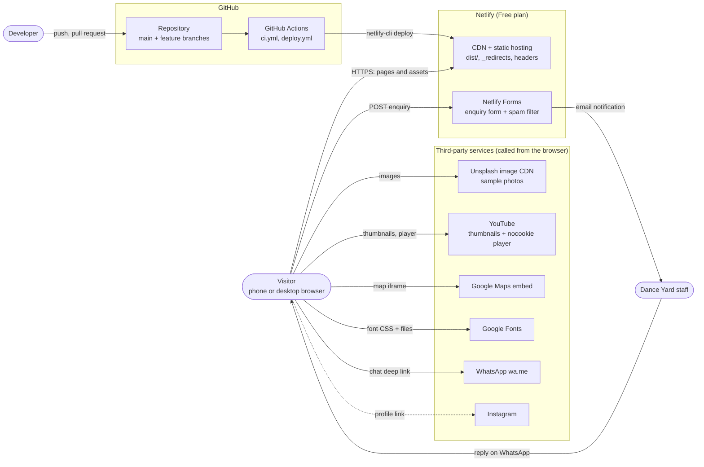
```mermaid
flowchart LR
  visitor(["Visitor<br/>phone or desktop browser"])
  staff(["Dance Yard staff"])
  dev(["Developer"])

  subgraph netlify["Netlify (Free plan)"]
    cdn["CDN + static hosting<br/>dist/, _redirects, headers"]
    forms["Netlify Forms<br/>enquiry form + spam filter"]
  end

  subgraph github["GitHub"]
    repo["Repository<br/>main + feature branches"]
    actions["GitHub Actions<br/>ci.yml, deploy.yml"]
  end

  subgraph third["Third-party services (called from the browser)"]
    unsplash["Unsplash image CDN<br/>sample photos"]
    yt["YouTube<br/>thumbnails + nocookie player"]
    maps["Google Maps embed"]
    fonts["Google Fonts"]
    wa["WhatsApp wa.me"]
    ig["Instagram"]
  end

  visitor -- "HTTPS: pages and assets" --> cdn
  visitor -- "POST enquiry" --> forms
  visitor -- "images" --> unsplash
  visitor -- "thumbnails, player" --> yt
  visitor -- "map iframe" --> maps
  visitor -- "font CSS + files" --> fonts
  visitor -- "chat deep link" --> wa
  visitor -. "profile link" .-> ig
  forms -- "email notification" --> staff
  staff -- "reply on WhatsApp" --> visitor
  dev -- "push, pull request" --> repo
  repo --> actions
  actions -- "netlify-cli deploy" --> cdn
```

### 3.3 Technology stack

| Layer | Choice | Version | Notes |
|---|---|---|---|
| UI library | React | 19.2 | Uses React 19 features: `<title>`/`<meta>` rendered from page components, `<Context value>` provider shorthand, boolean `inert` prop |
| Build tool | Vite + `@vitejs/plugin-react` | 8.3 / 6.1 | `vite build` → `dist/` |
| Language | JavaScript (ESM + JSX) | – | No TypeScript; `@types/react` is installed for editor hints |
| Styling | CSS Modules + global CSS custom properties | – | 27 co-located `*.module.css` files, `styles/variables.css`, `styles/global.css` |
| Linting | oxlint (`react`, `oxc` plugins) | 1.81 | `rules-of-hooks` is an error |
| Node | Node.js | 22 (`.nvmrc`) | Build time only |
| Hosting | Netlify Free | – | Static files only; Netlify does not build |
| Forms | Netlify Forms | – | Registered from a hidden form in `index.html` |
| CI/CD | GitHub Actions + `netlify-cli` (via `npx`) | – | PR previews; Dev → UAT → Live deploys with approval gates |
| Video | YouTube privacy-enhanced embeds | – | `youtube-nocookie.com`, loaded on click |
| Images | Unsplash CDN (sample content) | – | Responsive `srcset`, 480–2000 px |
| Maps | Google Maps embed URL | – | No API key needed |
| Fonts | Google Fonts | – | Poppins (body), Unbounded (display), Monoton (neon) |
| Icons | Inline SVG set | – | `components/common/Icon.jsx` |

### 3.4 Deployment architecture

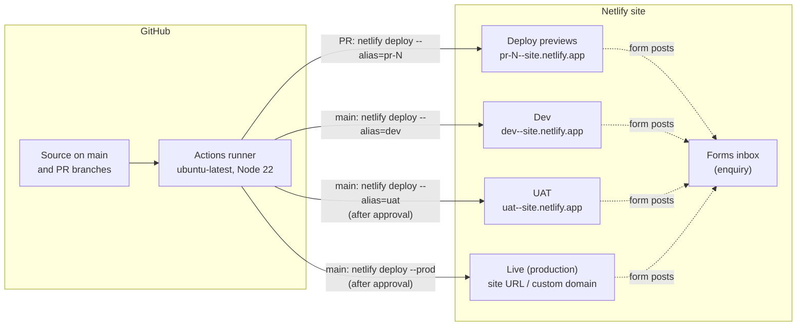
```mermaid
flowchart LR
  subgraph gh["GitHub"]
    code["Source on main<br/>and PR branches"]
    ci["Actions runner<br/>ubuntu-latest, Node 22"]
  end
  subgraph nf["Netlify site"]
    prev["Deploy previews<br/>pr-N--site.netlify.app"]
    devenv["Dev<br/>dev--site.netlify.app"]
    uatenv["UAT<br/>uat--site.netlify.app"]
    prod["Live (production)<br/>site URL / custom domain"]
    inbox["Forms inbox<br/>(enquiry)"]
  end
  code --> ci
  ci -- "PR: netlify deploy --alias=pr-N" --> prev
  ci -- "main: netlify deploy --alias=dev" --> devenv
  ci -- "main: netlify deploy --alias=uat<br/>(after approval)" --> uatenv
  ci -- "main: netlify deploy --prod<br/>(after approval)" --> prod
  prev -. "form posts" .-> inbox
  devenv -. "form posts" .-> inbox
  uatenv -. "form posts" .-> inbox
  prod -. "form posts" .-> inbox
```

Each Netlify deploy is atomic and immutable: a new production deploy switches over in one step, and any earlier deploy can be re-published for an instant rollback (§6.4). Dev and UAT are fixed aliases on the same site, so they share its forms inbox: test enquiries sent from Dev or UAT reach the studio's notification email too.

### 3.5 CI/CD pipeline

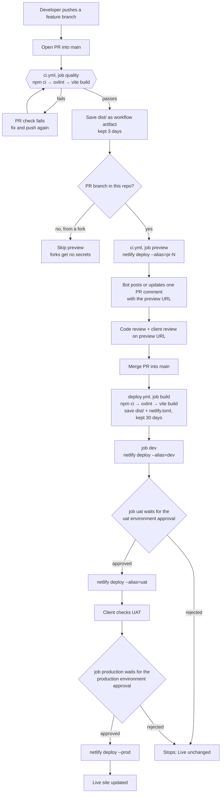
```mermaid
flowchart TD
  A["Developer pushes a feature branch"] --> C["Open PR into main"]
  C --> D{{"ci.yml, job quality<br/>npm ci → oxlint → vite build"}}
  D -- fails --> X["PR check fails<br/>fix and push again"]
  X --> D
  D -- passes --> E["Save dist/ as workflow artifact<br/>kept 3 days"]
  E --> F{"PR branch in this repo?"}
  F -- "no, from a fork" --> G["Skip preview<br/>forks get no secrets"]
  F -- yes --> H["ci.yml, job preview<br/>netlify deploy --alias=pr-N"]
  H --> I["Bot posts or updates one PR comment<br/>with the preview URL"]
  I --> J["Code review + client review on preview URL"]
  J --> K["Merge PR into main"]
  K --> M["deploy.yml, job build<br/>npm ci → oxlint → vite build<br/>save dist/ + netlify.toml, kept 30 days"]
  M --> N["job dev<br/>netlify deploy --alias=dev"]
  N --> Q{"job uat waits for the<br/>uat environment approval"}
  Q -- approved --> R["netlify deploy --alias=uat"]
  R --> S["Client checks UAT"]
  S --> L{"job production waits for the<br/>production environment approval"}
  L -- approved --> T["netlify deploy --prod"]
  T --> O["Live site updated"]
  Q -- rejected --> P["Stops; Live unchanged"]
  L -- rejected --> P
```

Pipeline properties:

| Property | ci.yml (pull requests) | deploy.yml (main) |
|---|---|---|
| Trigger | PR opened/updated against `main` | Push to `main`, or manual "Run workflow" |
| Concurrency | One run per PR; a new push cancels the old run | One deploy per environment at a time; queued, never cancelled |
| Token permissions | `contents: read`, `pull-requests: write` | `contents: read` |
| Gate | Lint + build must pass | Lint + build, then Dev → UAT (required reviewer on `uat`) → Live (required reviewer on `production`) |
| Output | Preview URL comment on the PR | Dev, UAT and Live deploys, each linked from its GitHub environment |
| Timeouts | 10 min build, 5 min preview | 10 min build, 5 min per deploy |

The same build moves through every environment: `deploy.yml` builds once and each deploy job uploads those exact files, so what the client approved on UAT is what goes live.

> The questionnaire proposed a `develop` branch for previews. The implementation keeps per-PR previews and adds Dev and UAT environments fed from `main` instead of extra branches.

### 3.6 Runtime request flow

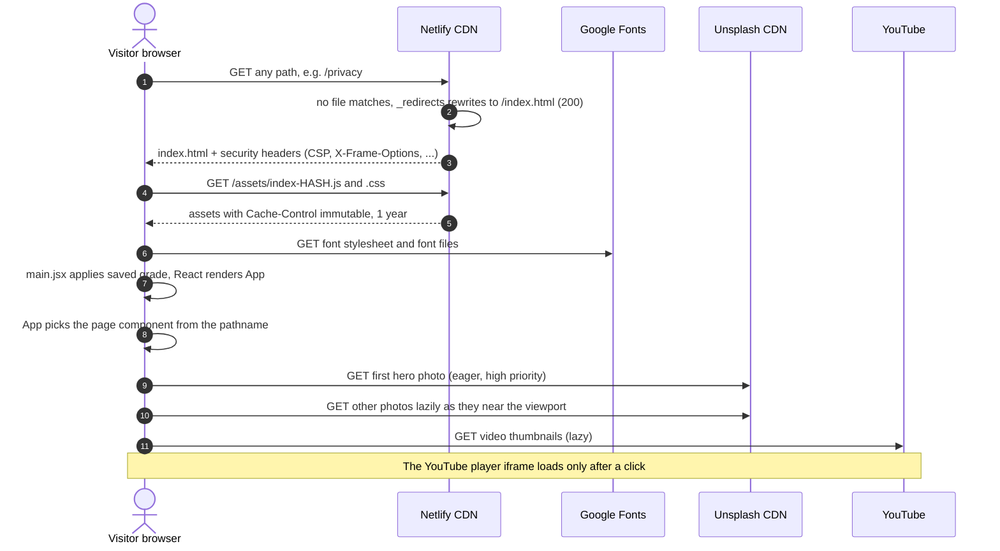
```mermaid
sequenceDiagram
  autonumber
  actor V as Visitor browser
  participant N as Netlify CDN
  participant G as Google Fonts
  participant U as Unsplash CDN
  participant Y as YouTube
  V->>N: GET any path, e.g. /privacy
  N->>N: no file matches, _redirects rewrites to /index.html (200)
  N-->>V: index.html + security headers (CSP, X-Frame-Options, ...)
  V->>N: GET /assets/index-HASH.js and .css
  N-->>V: assets with Cache-Control immutable, 1 year
  V->>G: GET font stylesheet and font files
  V->>V: main.jsx applies saved grade, React renders App
  V->>V: App picks the page component from the pathname
  V->>U: GET first hero photo (eager, high priority)
  V->>U: GET other photos lazily as they near the viewport
  V->>Y: GET video thumbnails (lazy)
  Note over V,Y: The YouTube player iframe loads only after a click
```

### 3.7 Visitor journey and conversion flow

The primary goal is an enquiry or a WhatsApp conversation (client CTA: **"Enroll Now"**, badge **"Limited Admission"**).

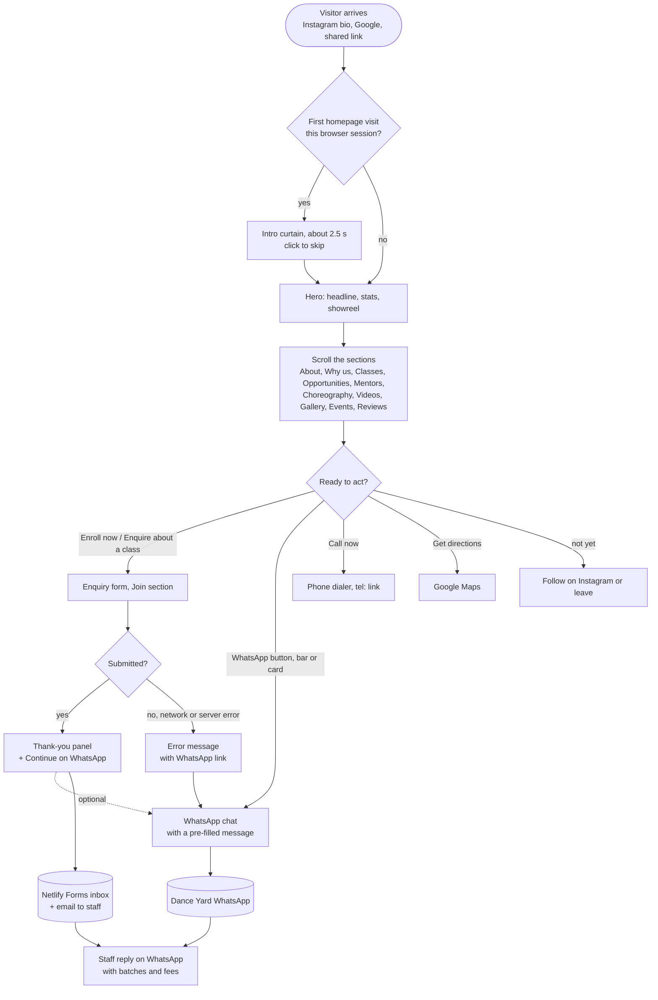
```mermaid
flowchart TD
  start(["Visitor arrives<br/>Instagram bio, Google, shared link"]) --> first{"First homepage visit<br/>this browser session?"}
  first -- yes --> curtain["Intro curtain, about 2.5 s<br/>click to skip"]
  first -- no --> hero
  curtain --> hero["Hero: headline, stats, showreel"]
  hero --> browse["Scroll the sections<br/>About, Why us, Classes, Opportunities, Mentors,<br/>Choreography, Videos, Gallery, Events, Reviews"]
  browse --> decide{"Ready to act?"}
  decide -- "Enroll now / Enquire about a class" --> form["Enquiry form, Join section"]
  decide -- "WhatsApp button, bar or card" --> wa["WhatsApp chat<br/>with a pre-filled message"]
  decide -- "Call now" --> call["Phone dialer, tel: link"]
  decide -- "Get directions" --> maps["Google Maps"]
  decide -- "not yet" --> social["Follow on Instagram or leave"]
  form --> ok{"Submitted?"}
  ok -- yes --> thanks["Thank-you panel<br/>+ Continue on WhatsApp"]
  ok -- "no, network or server error" --> fallback["Error message<br/>with WhatsApp link"]
  fallback --> wa
  thanks -. optional .-> wa
  thanks --> lead[("Netlify Forms inbox<br/>+ email to staff")]
  wa --> chat[("Dance Yard WhatsApp")]
  lead --> follow["Staff reply on WhatsApp<br/>with batches and fees"]
  chat --> follow
```

### 3.8 Site map

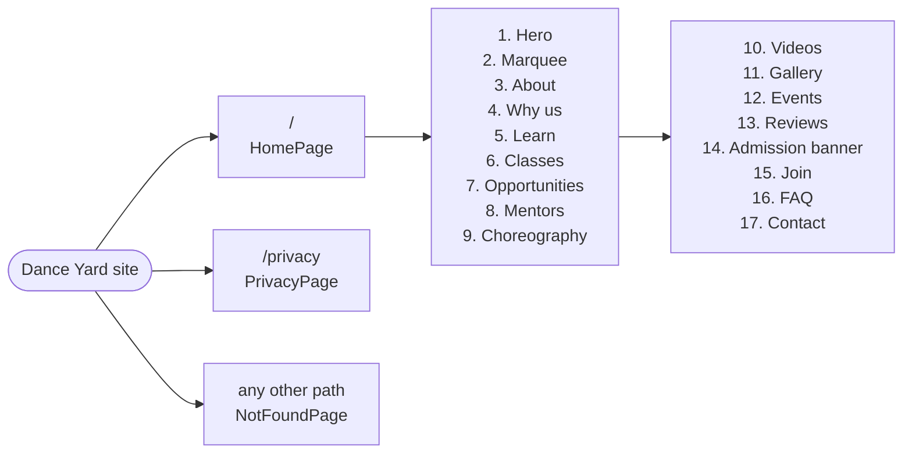
```mermaid
flowchart LR
  site(["Dance Yard site"]) --> home["/<br/>HomePage"]
  site --> privacy["/privacy<br/>PrivacyPage"]
  site --> other["any other path<br/>NotFoundPage"]
  home --> top["1. Hero<br/>2. Marquee<br/>3. About<br/>4. Why us<br/>5. Learn<br/>6. Classes<br/>7. Opportunities<br/>8. Mentors<br/>9. Choreography"]
  top --> bottom["10. Videos<br/>11. Gallery<br/>12. Events<br/>13. Reviews<br/>14. Admission banner<br/>15. Join<br/>16. FAQ<br/>17. Contact"]
```

Homepage sections run top to bottom in the order shown; their anchor ids are in the [section inventory](#section-inventory). Header links: About, Classes, Opportunities, Choreography, Videos, Gallery, Contact, plus "Enroll now" → `#join`. Footer adds Events and FAQ.

### 3.9 External integrations

| Service | Used for | How | Data sent from the visitor's browser | Failure behaviour |
|---|---|---|---|---|
| Netlify Forms | Enquiries | `fetch('/', POST)`, urlencoded | Form fields | Error message with WhatsApp link |
| WhatsApp | Conversations | `https://wa.me/<number>?text=<message>` links | Pre-filled message (only when the visitor taps) | n/a – opens WhatsApp |
| YouTube | Videos | Thumbnails from `i.ytimg.com`; player from `youtube-nocookie.com` on click | Thumbnail requests; player requests after click | Thumbnail falls back from HD to HQ |
| Unsplash | Sample photos | `images.unsplash.com/<id>?auto=format&w=…` | Image requests | Alt text shows; no fallback |
| Google Maps | Map + directions | Embed iframe (lazy) and search URL | Map requests when the Contact section loads | "Get directions" card still works |
| Google Fonts | Typography | Stylesheet link with `display=swap` | Font requests on every page | System font fallbacks |
| Instagram | Social | Plain link | Nothing until clicked | n/a |

---

## 4. Low-level design

### 4.1 Repository structure

```text
Danceyard87Portfolio/
├── .github/workflows/
│   ├── ci.yml                 # PR: lint, build, Netlify preview, PR comment
│   └── deploy.yml             # main: lint, build once, deploy Dev → UAT → Live (approved)
├── docs/
│   ├── functional-spec/       # client questionnaire + client profile
│   └── tech-spec/             # this document
├── public/                    # copied as-is into dist/
│   ├── _redirects             # /*  /index.html  200
│   ├── favicon.svg
│   └── robots.txt
├── src/
│   ├── main.jsx               # entry: global CSS, saved grade, React root
│   ├── App.jsx                # shell + tiny path router
│   ├── pages/                 # HomePage, PrivacyPage, NotFoundPage (+ Page.module.css)
│   ├── sections/              # 17 homepage sections, each with a .module.css
│   ├── components/
│   │   ├── layout/            # Header, Footer, FloatingActions, GradeSwitcher
│   │   └── common/            # Dialog, VideoModal, Lightbox, GradedImage, Reveal, effects...
│   ├── context/VideoContext.js
│   ├── hooks/                 # useInView, useActiveSection, useButtonRipple
│   ├── utils/                 # contact, media, events, grade, motion, pointer
│   ├── data/                  # danceyard.json (content), photos.json (photo catalogue)
│   └── styles/                # variables.css (tokens + grades), global.css (base + utilities)
├── index.html                 # meta, JSON-LD, fonts, hidden Netlify form, root div
├── netlify.toml               # publish dir, security headers, asset caching
├── vite.config.js
├── .oxlintrc.json
└── package.json
```

### 4.2 Module layering

Dependencies point downward only. Data and utilities never import components.

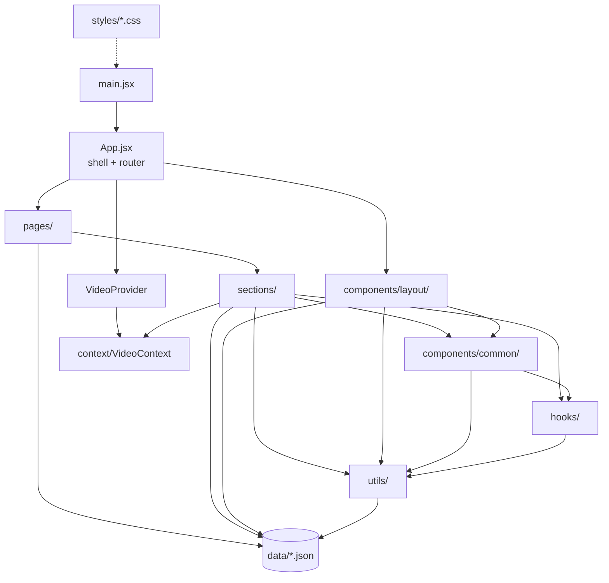
```mermaid
flowchart TD
  entry["main.jsx"] --> app["App.jsx<br/>shell + router"]
  app --> pages["pages/"]
  app --> layout["components/layout/"]
  app --> provider["VideoProvider"]
  pages --> sections["sections/"]
  sections --> common["components/common/"]
  layout --> common
  provider --> ctx["context/VideoContext"]
  sections --> ctx
  sections --> hooks["hooks/"]
  common --> hooks
  sections --> utils["utils/"]
  layout --> utils
  common --> utils
  hooks --> utils
  pages --> data[("data/*.json")]
  sections --> data
  layout --> data
  utils --> data
  styles["styles/*.css"] -.-> entry
```

Rules:

- A section never imports another section. Cross-section actions go through `utils/events.js` (DOM event) or `VideoContext`.
- Components read content from `data/` directly; no props drilling from the page.
- Values that change per render (pointer position, stagger index, progress) reach CSS through custom properties, not hard-coded inline styles.

### 4.3 Application boot sequence

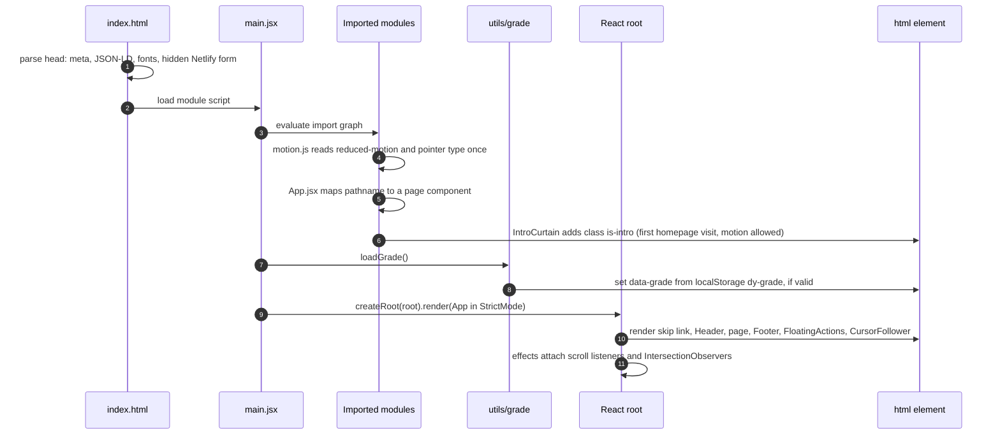
```mermaid
sequenceDiagram
  autonumber
  participant HTML as index.html
  participant Main as main.jsx
  participant Mods as Imported modules
  participant Grade as utils/grade
  participant Root as React root
  participant Doc as html element
  HTML->>HTML: parse head: meta, JSON-LD, fonts, hidden Netlify form
  HTML->>Main: load module script
  Main->>Mods: evaluate import graph
  Mods->>Mods: motion.js reads reduced-motion and pointer type once
  Mods->>Mods: App.jsx maps pathname to a page component
  Mods->>Doc: IntroCurtain adds class is-intro (first homepage visit, motion allowed)
  Main->>Grade: loadGrade()
  Grade->>Doc: set data-grade from localStorage dy-grade, if valid
  Main->>Root: createRoot(root).render(App in StrictMode)
  Root->>Doc: render skip link, Header, page, Footer, FloatingActions, CursorFollower
  Root->>Root: effects attach scroll listeners and IntersectionObservers
```

Several decisions are made **once at module load**: the current page, `reducedMotion`, `finePointer`, and whether the intro plays. Changing OS motion settings mid-visit takes effect on the next page load.

### 4.4 Routing

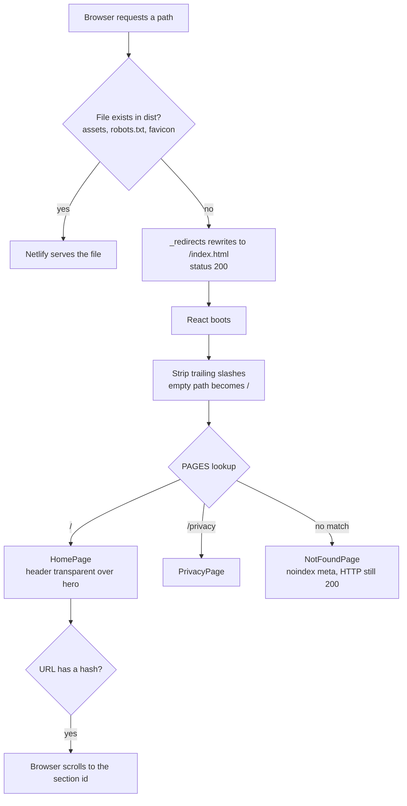
```mermaid
flowchart TD
  req["Browser requests a path"] --> file{"File exists in dist?<br/>assets, robots.txt, favicon"}
  file -- yes --> serve["Netlify serves the file"]
  file -- no --> rw["_redirects rewrites to /index.html<br/>status 200"]
  rw --> boot["React boots"]
  boot --> norm["Strip trailing slashes<br/>empty path becomes /"]
  norm --> lookup{"PAGES lookup"}
  lookup -- "/" --> home["HomePage<br/>header transparent over hero"]
  lookup -- "/privacy" --> priv["PrivacyPage"]
  lookup -- "no match" --> nf["NotFoundPage<br/>noindex meta, HTTP still 200"]
  home --> hash{"URL has a hash?"}
  hash -- yes --> jump["Browser scrolls to the section id"]
```

Implementation (`App.jsx`):

```js
const PAGES = { '/': HomePage, '/privacy': PrivacyPage }
const path = window.location.pathname.replace(/\/+$/, '') || '/'
const Page = PAGES[path] ?? NotFoundPage
```

- All internal links are plain `<a href>`. Section links are written `/#id` so they also work from `/privacy` (full page load to the homepage).
- Pages set their own `<title>` and `<meta>` by rendering them; React 19 hoists them into `<head>`.
- Replace with React Router if the site grows past three or four pages.

### 4.5 Component tree

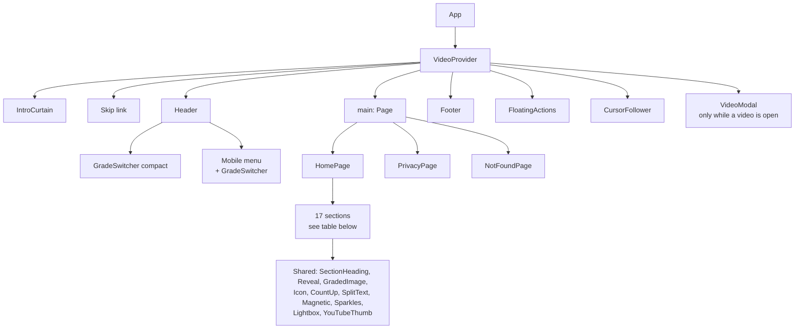
```mermaid
flowchart TD
  App --> VP["VideoProvider"]
  VP --> IC["IntroCurtain"]
  VP --> SL["Skip link"]
  VP --> H["Header"]
  VP --> M["main: Page"]
  VP --> F["Footer"]
  VP --> FA["FloatingActions"]
  VP --> CF["CursorFollower"]
  VP --> VM["VideoModal<br/>only while a video is open"]
  H --> GS1["GradeSwitcher compact"]
  H --> MM["Mobile menu<br/>+ GradeSwitcher"]
  M --> HP["HomePage"]
  M --> PP["PrivacyPage"]
  M --> NF["NotFoundPage"]
  HP --> SEC["17 sections<br/>see table below"]
  SEC --> CMN["Shared: SectionHeading, Reveal, GradedImage,<br/>Icon, CountUp, SplitText, Magnetic, Sparkles,<br/>Lightbox, YouTubeThumb"]
```

#### Section inventory

| # | Component | Anchor | Content key(s) | Behaviour |
|---|---|---|---|---|
| 1 | `Hero` | – (`h1#hero-title`) | `hero`, `stats`, `videos` | Photo cross-fade every 6 s; showreel opens video modal; animated stats; sparkles; pointer spotlight |
| 2 | `Marquee` | – | `marquee` | Two ribbons in opposite directions; page scroll speeds and skews them |
| 3 | `About` | `about` | `about` | Clip reveals, spinning "20+ years" badge, mission card |
| 4 | `WhyUs` | `why` | `why` | Bento grid; stat cards count up; tilt + spotlight on hover |
| 5 | `Learn` | `learn` | `learn` | Numbered steps |
| 6 | `Programs` | `classes` | `programs` | Audience filter (All / Kids / Teens & adults); "Enquire about X" pre-selects the form; WhatsApp link for current batches |
| 7 | `Opportunities` | `opportunities` | `opportunities` | Pinned horizontal scroll on screens ≥ 960 px; ends with an Enroll CTA panel |
| 8 | `Mentors` | `mentors` | `mentors` | Choreographer names highlighted in colour; text fills in on scroll |
| 9 | `Choreography` | `choreography` | `choreography` | Service cards; "Book choreography" WhatsApp CTA |
| 10 | `Videos` | `videos` | `videos`, `videosNote` | Category filter; first card featured; click plays in the modal |
| 11 | `Gallery` | `gallery` | `gallery` + `photos.json` | Category filter; masonry; lightbox |
| 12 | `Events` | `events` | `events` | Event cards with WhatsApp "Get details" |
| 13 | `Testimonials` | `testimonials` | `testimonials`, `testimonialsNote` | One quote at a time; autoplay 7 s; pauses on hover/focus |
| 14 | `AdmissionBanner` | – | static text | "Limited Admission" banner with sparkles and Enroll CTA |
| 15 | `Join` | `join` | `programs` (form options) | Enquiry form (§4.8.1) |
| 16 | `Faq` | `faq` | `faqs` | Accordion, one open at a time, first open by default |
| 17 | `Contact` | `contact` | `contact`, `location` | WhatsApp, call, directions and Instagram cards; lazy map iframe |

### 4.6 Data model

All content is bundled at build time from two JSON files. Changing them requires a rebuild and deploy (normal PR flow).

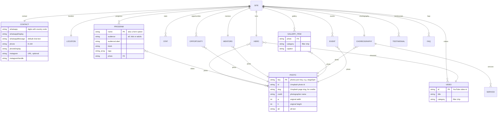
```mermaid
erDiagram
  SITE ||--|| CONTACT : contact
  SITE ||--|| LOCATION : location
  SITE ||--|| HERO : hero
  SITE ||--o{ STAT : stats
  SITE ||--o{ PROGRAM : programs
  SITE ||--o{ OPPORTUNITY : opportunities
  SITE ||--|| MENTORS : mentors
  SITE ||--|| CHOREOGRAPHY : choreography
  CHOREOGRAPHY ||--o{ SERVICE : services
  SITE ||--o{ VIDEO : videos
  SITE ||--o{ GALLERY_ITEM : gallery
  SITE ||--o{ EVENT : events
  SITE ||--o{ TESTIMONIAL : testimonials
  SITE ||--o{ FAQ : faqs
  HERO }o--o{ PHOTO : "slides"
  HERO }o--|| VIDEO : "showreel"
  PROGRAM }o--|| PHOTO : "photo"
  OPPORTUNITY }o--|| PHOTO : "photo"
  MENTORS }o--|| PHOTO : "photo"
  CHOREOGRAPHY }o--|| PHOTO : "photo"
  GALLERY_ITEM }o--|| PHOTO : "photo"
  EVENT }o--|| PHOTO : "photo"
  PHOTO {
    string key PK "photos.json key, e.g. stageSpin"
    string id "Unsplash photo id"
    string slug "Unsplash page slug, for credits"
    string credit "photographer name"
    int w "original width"
    int h "original height"
    string alt "alt text"
  }
  PROGRAM {
    string name PK "also a form option"
    string audience "all, kids or adults"
    string audienceLabel
    string blurb
    string_array tags
    string photo FK
  }
  VIDEO {
    string id PK "YouTube video id"
    string title
    string category "filter chip"
  }
  GALLERY_ITEM {
    string photo FK
    string category "filter chip"
    string caption
  }
  CONTACT {
    string whatsapp "digits with country code"
    string whatsappDisplay
    string whatsappMessage "default chat text"
    string phone "E.164"
    string phoneDisplay
    string instagram "URL, optional"
    string instagramHandle
  }
```

#### `danceyard.json` schema

| Key | Type | Used by | Notes |
|---|---|---|---|
| `name`, `shortName`, `positioning` | string | Footer, Contact, Privacy | |
| `location` | `{ venue, street, locality, area, city, region, postalCode, mapQuery, mapUrl }` | `utils/contact`, Contact | `mapQuery` drives the embedded map; `mapUrl` (Google Maps share link) is the "Get directions" link; `area` + `city` are the short form used in copy |
| `contact` | see ER diagram | `utils/contact`, Header, Footer, Contact | `instagram` is optional – UI hides Instagram links when empty |
| `hero` | `{ eyebrow, lead, slides: photoKey[], showreel: videoId }` | Hero | First slide loads eagerly |
| `stats` | `{ value, label }[]` | Hero | `value` like `"20+"`; `CountUp` animates the number part |
| `marquee` | `string[][]` (two rows) | Marquee | |
| `about` | `{ paragraphs[], mission, photos: [main, side] }` | About | |
| `why` | `{ stat? \| icon?, title, text, big? }[]` | WhyUs | `stat` shows a counter, otherwise `icon` |
| `learn` | `{ icon, title, text }[]` | Learn | |
| `programs` | see ER diagram | Programs, Footer, Join | Names become form options |
| `opportunities` | `{ icon, title, text, photo }[]` | Opportunities | |
| `mentors` | `{ statement, detail, names[], photo }` | Mentors | Each name must appear verbatim in `statement` to be highlighted |
| `choreography` | `{ photo, services: { icon, title, text }[] }` | Choreography | |
| `videosNote`, `videos` | string, see ER diagram | Videos, Hero | |
| `gallery` | see ER diagram | Gallery | Categories are derived from entries |
| `events` | `{ type, title, when, text, photo }[]` | Events | `when` is free text ("Date to be announced") |
| `testimonialsNote`, `testimonials` | string, `{ quote, who, detail }[]` | Testimonials | |
| `faqs` | `{ q, a }[]` | Faq | |
| `footer` | `{ blurb }` | Footer | |

#### Data integrity rules

Nothing enforces these today. §7 proposes a check that runs in CI.

| # | Rule | What happens if broken |
|---|---|---|
| R1 | Every photo key (`hero.slides`, `about.photos`, `programs[].photo`, `opportunities[].photo`, `mentors.photo`, `choreography.photo`, `gallery[].photo`, `events[].photo`) exists in `photos.json` | **Whole page goes blank** – `GradedImage` reads `photo.id` of `undefined` and there is no error boundary |
| R2 | `hero.showreel` matches a `videos[].id` | "Watch showreel" silently does nothing |
| R3 | Values used as React keys are unique within their list: `programs[].name`, `why/learn/opportunities/services/events[].title`, `faqs[].q`, `testimonials[].quote`, `videos[].id`, gallery photo ids | Duplicate-key warnings; wrong items may update |
| R4 | `icon` values exist in `Icon.jsx` | Empty icon (no crash) |
| R5 | `contact.whatsapp` is digits only, with country code (`91…`) | Broken WhatsApp links |
| R6 | `mentors.names` contain no regex special characters (or get escaped) | Highlighting breaks |
| R7 | First entry in `GRADES` (`utils/grade.js`) equals `<html data-grade>` in `index.html` | Flash of the wrong colours before JS runs |

### 4.7 State management

There is no global store. State lives in the component that owns it; the two cross-cutting cases use a context (video player) and a DOM event (class pre-select). The colour grade lives on the `<html>` element itself so CSS can react without React re-rendering.

| State | Owner | Mechanism | Persisted |
|---|---|---|---|
| Current page | `App.jsx` module scope | Pathname lookup at load | – |
| Colour grade | `<html data-grade>` | DOM attribute; `MutationObserver` + `useSyncExternalStore` for readers | `localStorage` `dy-grade` |
| Intro already played | `IntroCurtain` | Module-level flag | `sessionStorage` `dy-intro-seen` |
| Open video | `VideoProvider` | `useState`, setter shared through `VideoContext` | – |
| Selected class in form | `Join` | `useState`; set by window event `dy:select-program` | – |
| Form status | `Join` | `useState`: `idle`, `sending`, `sent`, `error` | – |
| Class filter | `Programs` | `useState` | – |
| Video filter | `Videos` | `useState` | – |
| Gallery filter, lightbox index | `Gallery` | `useState` | – |
| Open FAQ | `Faq` | `useState`, default 0 | – |
| Review index, paused | `Testimonials` | `useState` + timeout | – |
| Hero slide | `Hero` | `useState` + 6 s interval | – |
| Menu open, scrolled | `Header` | `useState` + scroll listener | – |
| Active nav link | `useActiveSection` | `IntersectionObserver` | – |
| Floating actions visible | `FloatingActions` | Scroll listener | – |

### 4.8 Feature flows

#### 4.8.1 Enquiry form (Netlify Forms)

**Registration.** Netlify does not run JavaScript when it scans a deploy, so it can't see the React form. A hidden static copy in `index.html` with the same `name="enquiry"` and the same field names registers the form at deploy time. The two must stay in sync (see the contract test in §7).

**Fields**

| `name` | Label | Control | Required | Validation / default |
|---|---|---|---|---|
| `form-name` | – | hidden | – | Always `enquiry` (tells Netlify which form) |
| `bot-field` | – | text in a hidden paragraph | – | Must stay empty (honeypot) |
| `name` | Student's name | text | Yes | `autocomplete="name"`; focused after a class pre-select |
| `parentName` | Parent's name (under 18) | text | No | |
| `age` | Age | number | No | 3–99 |
| `phone` | WhatsApp number | tel | Yes | Pattern `[0-9+ ]{10,15}` |
| `email` | Email | email | No | Browser email format |
| `program` | Class or service | select (controlled) | Yes | `programs[].name` + "Choreography (wedding, sangeet or event)", "Photo & video shoot", "Not sure yet" |
| `batch` | Preferred batch | select | No | Weekday mornings / Weekday evenings / Weekends / **Flexible** (default) |
| `level` | Experience | radio | – | **Beginner** (default) / Intermediate / Advanced |
| `heardFrom` | How did you hear about us? | select | No | Empty (default) / Instagram / YouTube / Google search / Friend or family / Saw a performance / Other |
| `message` | Anything else? | textarea | No | |

**State machine**

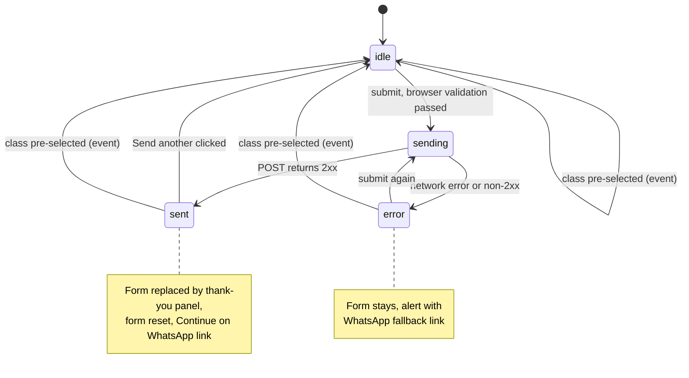
```mermaid
stateDiagram-v2
  [*] --> idle
  idle --> idle: class pre-selected (event)
  idle --> sending: submit, browser validation passed
  sending --> sent: POST returns 2xx
  sending --> error: network error or non-2xx
  error --> sending: submit again
  error --> idle: class pre-selected (event)
  sent --> idle: Send another clicked
  sent --> idle: class pre-selected (event)
  note right of sent
    Form replaced by thank-you panel,
    form reset, Continue on WhatsApp link
  end note
  note right of error
    Form stays, alert with
    WhatsApp fallback link
  end note
```

While `sending`, the submit button is disabled and reads "Sending…".

**Submission sequence**

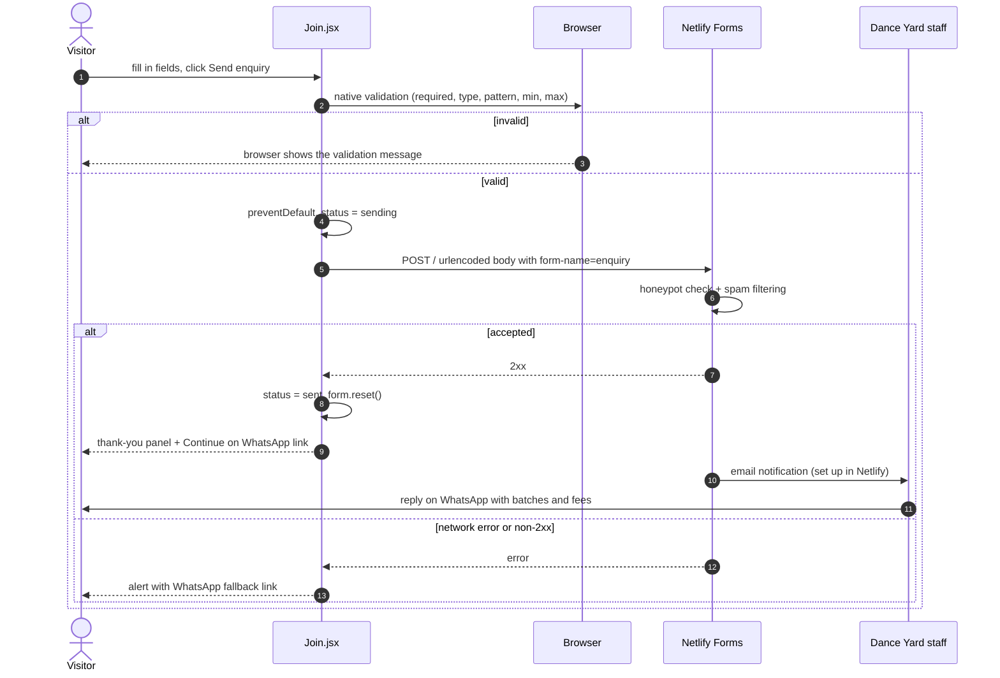
```mermaid
sequenceDiagram
  autonumber
  actor U as Visitor
  participant J as Join.jsx
  participant B as Browser
  participant NF as Netlify Forms
  participant S as Dance Yard staff
  U->>J: fill in fields, click Send enquiry
  J->>B: native validation (required, type, pattern, min, max)
  alt invalid
    B-->>U: browser shows the validation message
  else valid
    J->>J: preventDefault, status = sending
    J->>NF: POST / urlencoded body with form-name=enquiry
    NF->>NF: honeypot check + spam filtering
    alt accepted
      NF-->>J: 2xx
      J->>J: status = sent, form.reset()
      J-->>U: thank-you panel + Continue on WhatsApp link
      NF->>S: email notification (set up in Netlify)
      S->>U: reply on WhatsApp with batches and fees
    else network error or non-2xx
      NF-->>J: error
      J-->>U: alert with WhatsApp fallback link
    end
  end
```

Notes:

- The POST goes to the site's own origin, which the CSP's `default-src 'self'` allows.
- The Vite dev server doesn't implement Netlify Forms; locally a submit ends in the `error` state. Test forms on a deploy preview (or with `netlify dev`).
- Submissions from deploy previews land in the same Netlify inbox. Put "TEST" in the message when testing.

#### 4.8.2 "Enquire about a class" pre-select

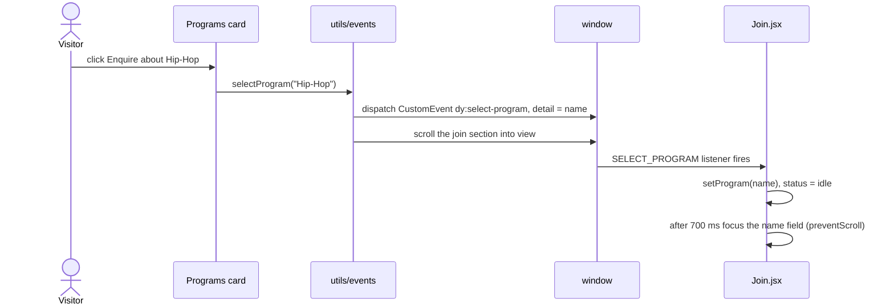
```mermaid
sequenceDiagram
  actor U as Visitor
  participant P as Programs card
  participant E as utils/events
  participant W as window
  participant J as Join.jsx
  U->>P: click Enquire about Hip-Hop
  P->>E: selectProgram("Hip-Hop")
  E->>W: dispatch CustomEvent dy:select-program, detail = name
  E->>W: scroll the join section into view
  W->>J: SELECT_PROGRAM listener fires
  J->>J: setProgram(name), status = idle
  J->>J: after 700 ms focus the name field (preventScroll)
```

The DOM event keeps `Programs` and `Join` independent: either can move or be removed without breaking the other.

#### 4.8.3 WhatsApp deep links

All links are built by `whatsappLink(message)` → `https://wa.me/<contact.whatsapp>?text=<encodeURIComponent(message)>`, opened in a new tab with `rel="noreferrer"`. The number is **WhatsApp-only**, so it never appears in a `tel:` link.

| Where | Pre-filled message |
|---|---|
| Floating button, mobile bar, header menu, footer, Contact card, form error | `contact.whatsappMessage` – "Hi Dance Yard! I'd like to know more about your dance classes." |
| Choreography CTA | "Hi Dance Yard! I'd like to book choreography for an event." |
| Classes note | "Hi Dance Yard! Which batches are open right now?" |
| Event card | "Hi Dance Yard! Please share details about: {event title}" |
| FAQ | "Hi Dance Yard! I have a question." |
| Form thank-you panel | "Hi Dance Yard! I'm {name}. I just sent an enquiry about {program}." |
| Privacy page | "Hi Dance Yard! I have a question about my data." |

#### 4.8.4 Video player

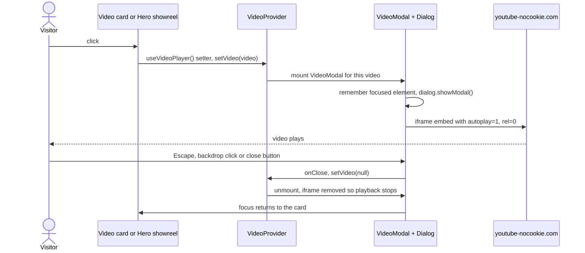
```mermaid
sequenceDiagram
  actor U as Visitor
  participant C as Video card or Hero showreel
  participant VP as VideoProvider
  participant VM as VideoModal + Dialog
  participant YT as youtube-nocookie.com
  U->>C: click
  C->>VP: useVideoPlayer() setter, setVideo(video)
  VP->>VM: mount VideoModal for this video
  VM->>VM: remember focused element, dialog.showModal()
  VM->>YT: iframe embed with autoplay=1, rel=0
  YT-->>U: video plays
  U->>VM: Escape, backdrop click or close button
  VM->>VP: onClose, setVideo(null)
  VP->>VM: unmount, iframe removed so playback stops
  VM->>C: focus returns to the card
```

Before the click, only a thumbnail image is loaded (`maxresdefault`, falling back to `hqdefault` when YouTube returns its 120 px placeholder). No YouTube scripts or cookies load until the visitor chooses to play.

#### 4.8.5 Gallery and lightbox

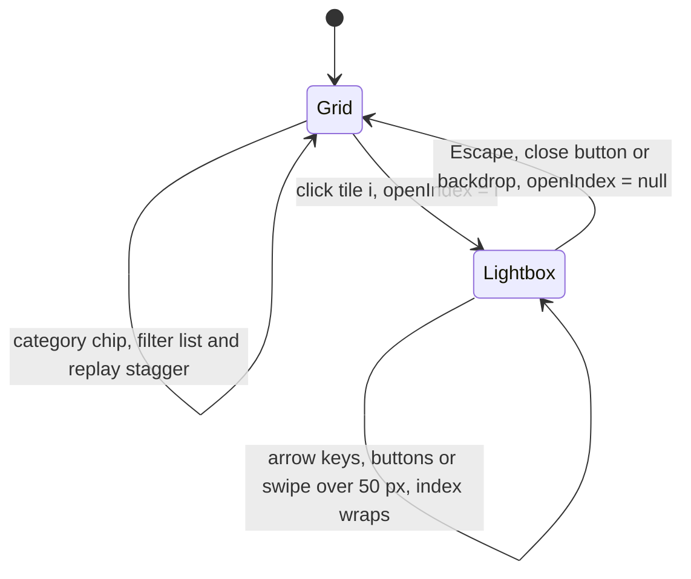
```mermaid
stateDiagram-v2
  [*] --> Grid
  Grid --> Grid: category chip, filter list and replay stagger
  Grid --> Lightbox: click tile i, openIndex = i
  Lightbox --> Lightbox: arrow keys, buttons or swipe over 50 px, index wraps
  Lightbox --> Grid: Escape, close button or backdrop, openIndex = null
```

- The lightbox receives the *filtered* list, so next/previous stays within the chosen category.
- Lightbox images load at 1800 px; the two neighbours are preloaded so navigation feels instant.
- Grid tiles are `<button>`s with an `aria-label` ("Open photo: …").

#### 4.8.6 Colour grade switching

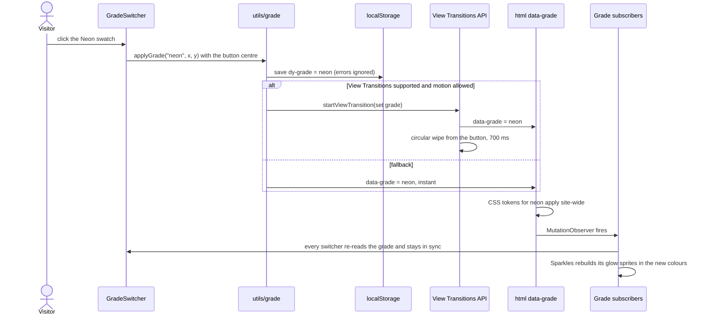
```mermaid
sequenceDiagram
  actor U as Visitor
  participant GS as GradeSwitcher
  participant G as utils/grade
  participant LS as localStorage
  participant VT as View Transitions API
  participant H as html data-grade
  participant Obs as Grade subscribers
  U->>GS: click the Neon swatch
  GS->>G: applyGrade("neon", x, y) with the button centre
  G->>LS: save dy-grade = neon (errors ignored)
  alt View Transitions supported and motion allowed
    G->>VT: startViewTransition(set grade)
    VT->>H: data-grade = neon
    VT->>VT: circular wipe from the button, 700 ms
  else fallback
    G->>H: data-grade = neon, instant
  end
  H->>H: CSS tokens for neon apply site-wide
  H->>Obs: MutationObserver fires
  Obs->>GS: every switcher re-reads the grade and stays in sync
  Obs->>Obs: Sparkles rebuilds its glow sprites in the new colours
```

How the grade reaches the screen:

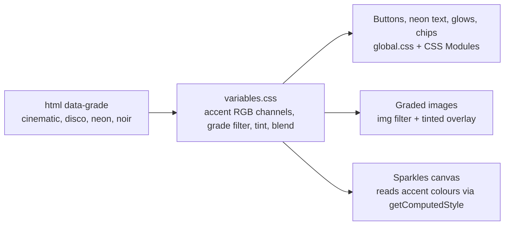
```mermaid
flowchart LR
  attr["html data-grade<br/>cinematic, disco, neon, noir"] --> tokens["variables.css<br/>accent RGB channels, grade filter, tint, blend"]
  tokens --> ui["Buttons, neon text, glows, chips<br/>global.css + CSS Modules"]
  tokens --> photos["Graded images<br/>img filter + tinted overlay"]
  tokens --> canvas["Sparkles canvas<br/>reads accent colours via getComputedStyle"]
```

| Grade | Default | Look |
|---|---|---|
| `cinematic` | Yes | Orange + teal film grade |
| `disco` | | Hot pink + violet, gold sparkle |
| `neon` | | Brochure look: neon green + pink |
| `noir` | | Off-white + red |

#### 4.8.7 Intro curtain

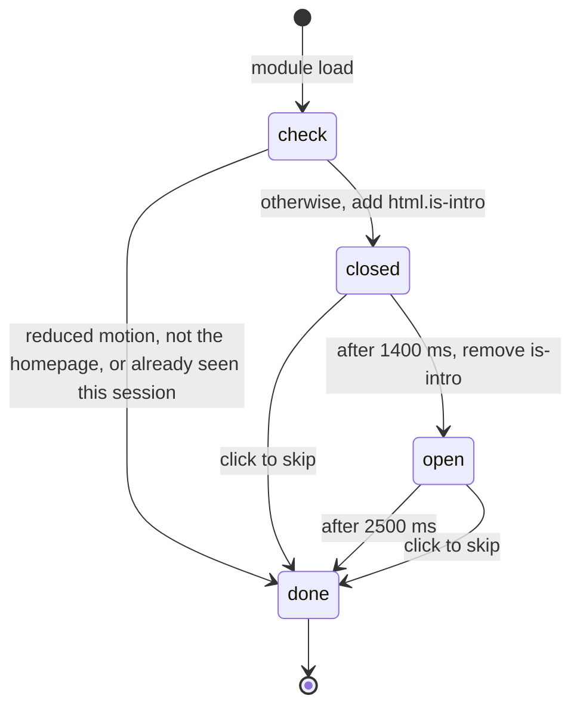
```mermaid
stateDiagram-v2
  [*] --> check: module load
  check --> done: reduced motion, not the homepage, or already seen this session
  check --> closed: otherwise, add html.is-intro
  closed --> open: after 1400 ms, remove is-intro
  closed --> done: click to skip
  open --> done: after 2500 ms
  open --> done: click to skip
  done --> [*]
```

While `html.is-intro` is set, the hero holds its letter-by-letter entrance so it plays as the curtains open. If `sessionStorage` is blocked, the intro never plays.

#### 4.8.8 Scroll and viewport behaviour

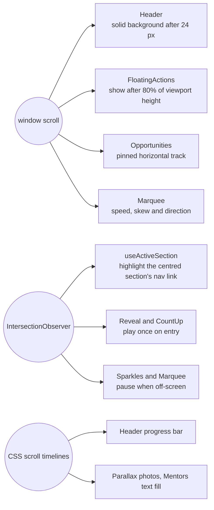
```mermaid
flowchart LR
  scroll(("window scroll")) --> hd["Header<br/>solid background after 24 px"]
  scroll --> fab["FloatingActions<br/>show after 80% of viewport height"]
  scroll --> opp["Opportunities<br/>pinned horizontal track"]
  scroll --> mq["Marquee<br/>speed, skew and direction"]
  io(("IntersectionObserver")) --> act["useActiveSection<br/>highlight the centred section's nav link"]
  io --> rev["Reveal and CountUp<br/>play once on entry"]
  io --> pause["Sparkles and Marquee<br/>pause when off-screen"]
  css(("CSS scroll timelines")) --> bar["Header progress bar"]
  css --> par["Parallax photos, Mentors text fill"]
```

| Behaviour | Where | Details |
|---|---|---|
| Header turns solid | `Header` | `scrollY > 24`, or always on non-home pages, or while the menu is open |
| Active nav link | `useActiveSection` | Observer with `rootMargin: -45% 0px -50% 0px` – the section crossing the middle of the viewport wins |
| Mobile menu | `Header` | Escape closes; page scroll locked while open; menu is `inert` when closed |
| Floating WhatsApp + mobile bar | `FloatingActions` | Visible once `scrollY > 0.8 × innerHeight` |
| Pinned horizontal scroll | `Opportunities` | Only when `(min-width: 960px)` and motion allowed. Section height = viewport height + track overflow; `progress = clamp(-sectionTop / overflow, 0, 1)`; track moves `-progress × overflow` px; panels lean into the movement and settle |
| Marquee | `Marquee` | Base 55 px/s, plus 14 px/s per unit of scroll velocity; skew up to 9°; reverses when scrolling up |
| Reveal | `Reveal`, `useInView` | Starts when the top edge is 12% above the viewport bottom; one-shot |
| Scroll progress, parallax, text fill | CSS `animation-timeline: scroll()/view()` | Only where supported (`@supports`) and motion allowed |

### 4.9 Utilities, hooks and context – API reference

**`utils/contact.js`**

| Export | Signature / value | Purpose |
|---|---|---|
| `whatsappLink` | `(message = contact.whatsappMessage) => string` | `wa.me` link with encoded message |
| `phoneLink` | `string` | `tel:+91…` |
| `mapEmbedUrl` | `string` | Google Maps embed URL for `location.mapQuery`, zoom 15 |
| `directionsUrl` | `string` | `location.mapUrl` |
| `addressLine` | `string` | "venue, street, locality, region postalCode" |

**`utils/media.js`**

| Export | Signature | Purpose |
|---|---|---|
| `photo` | `(key) => Photo \| undefined` | Look up `photos.json` |
| `allPhotos` | `Photo[]` | For footer credits |
| `photoUrl` | `(id, width = 1200) => string` | Unsplash URL, `auto=format&fit=crop&q=70` |
| `photoSrcSet` | `(id) => string` | Widths 480, 800, 1200, 1600, 2000 |
| `unsplashPage` | `(slug) => string` | Credit link |
| `youtubeThumb` | `(id, quality) => string` | `i.ytimg.com` thumbnail |
| `youtubeEmbed` | `(id) => string` | `youtube-nocookie.com` embed with `autoplay=1&rel=0&modestbranding=1&playsinline=1` |

**`utils/events.js`** – `SELECT_PROGRAM = 'dy:select-program'`; `selectProgram(name)` dispatches the event and scrolls to `#join`.

**`utils/grade.js`** – `GRADES` (id, label, swatch); `loadGrade()`; `applyGrade(id, x, y)`; `currentGrade()`; `subscribeGrade(callback) => unsubscribe`.

**`utils/motion.js`** – `reducedMotion`, `finePointer`: booleans read once at load.

**`utils/pointer.js`** – `trackPointer(e)` writes `--mx`, `--my` (px) and `--px`, `--py` (−0.5…0.5) onto the element; `resetPointer(e)` zeroes `--px`/`--py`. Used for spotlight and tilt effects.

**Hooks**

| Hook | Signature | Notes |
|---|---|---|
| `useInView` | `({ rootMargin, threshold }) => [ref, inView]` | One-shot; returns `true` immediately if `IntersectionObserver` is missing |
| `useActiveSection` | `(ids: string[]) => string \| null` | Id of the section in the middle of the viewport |
| `useButtonRipple` | `() => void` | One delegated `pointerdown` listener adds a ripple to any `.btn`; off for reduced motion |

**Context** – `VideoContext` holds the video setter; `useVideoPlayer()` returns it. Call `useVideoPlayer()(video)` with `{ id, title, category }`.

### 4.10 Shared components

| Component | Props | Notes |
|---|---|---|
| `Dialog` | `label, onClose, className, children, ...rest` | Native `<dialog>` + `showModal()`: browser handles Escape, focus trap and inert background. Backdrop click closes. Restores focus to the opener on unmount |
| `VideoModal` | `video, onClose` | Iframe exists only while open |
| `VideoProvider` | `children` | Provides `VideoContext`, renders `VideoModal` |
| `Lightbox` | `photos, index, onChange, onClose` | Keyboard, buttons, swipe; neighbour preload; counter and credit |
| `GradedImage` | `photo, sizes = '100vw', eager = false, className` | `srcset`, intrinsic `width`/`height` (prevents layout shift), lazy unless `eager`, `fetchPriority="high"` when eager |
| `YouTubeThumb` | `id, alt` | HD → HQ fallback |
| `Reveal` | `as = 'div', variant = 'up' \| 'left' \| 'right' \| 'scale' \| 'clip', delay, className, style` | Adds `is-visible` once in view |
| `SectionHeading` | `id, kicker, title, lead, center, compact` | `id` goes on the `<h2>` used by the section's `aria-labelledby` |
| `CountUp` | `value` | Parses prefix/number/suffix (`"20+"`, `"50,000+"`); eases over 1.6 s; screen readers get the final value |
| `SplitText` | `text, delay, className` | Per-letter spans for animation; screen readers get the plain text |
| `Magnetic` | `children, strength = 0.3` | Child drifts towards the cursor; fine pointers only |
| `Sparkles` | `className, density = 16000` | Canvas particles (max 90, DPR capped at 2); pauses off-screen and in background tabs; static frame for reduced motion |
| `CursorFollower` | – | Trailing ring with labels from `data-cursor`; fine pointers only; hidden over iframes |
| `IntroCurtain` | – | §4.8.7 |
| `Icon` | `name, size = 24, ...svgProps` | Inline 24×24 stroke icons, `aria-hidden` |
| `Logo` | `className` | Text logo; replace with the client's SVG when received |

### 4.11 Styling architecture

| Layer | File(s) | Contents |
|---|---|---|
| Tokens | `styles/variables.css` | Colours (accents as RGB channels so any alpha works), fonts, spacing scale, radii, easing, container width, header height; one override block per grade |
| Global | `styles/global.css` (~800 lines) | Reset and base, skip link, `.visually-hidden`, layout (`.container`, `.section`, `.section-raised`), headings (`.kicker`, `.section-title`, `.neon`, `.flicker`, `.outline-text`), buttons (`.btn-*`, `.ripple`), `.chips`, `.graded`, `.grain`, `.spotlight`, `.tilt`, `.reveal-*`, `.stagger-item`, `.split-char`, `.dialog`, scroll-driven animations, reduced-motion overrides |
| Component | `*.module.css` next to each component (27 files) | Scoped class names via CSS Modules |

Conventions:

- New styles go in the component's module. Add to `global.css` only for utilities shared by several components.
- Dynamic values pass through custom properties (`--i` stagger index, `--reveal-delay`, `--mx/--my/--px/--py`, `--tx/--ty`, `--progress`, `--skew`, `--c`, `--a/--b`).
- `@media (prefers-reduced-motion: reduce)` turns off all transitions and animations globally and shows revealed content in its final state.
- Fancy CSS (`animation-timeline`, view transitions) sits behind `@supports` or a JS feature check.

### 4.12 Media pipeline

| Media | Source today | Delivery | Target before launch |
|---|---|---|---|
| Photos | Unsplash (sample) | `auto=format` (WebP/AVIF), `srcset` 480–2000 px, lazy, intrinsic size | Client's own photos with publishing consent; self-hosted or on an image CDN, exported to AVIF/WebP |
| Hero | First slide eager + high priority; `preconnect` to `images.unsplash.com` | | Same, with preload of the real hero image |
| Videos | YouTube (sample videos) | Thumbnail facade → nocookie iframe on click | Dance Yard's own channel videos |
| Logo | Text logo | – | Client SVG; also use for `og:image` and favicon set |
| Fonts | Google Fonts, 3 families | `display=swap`, preconnect | Self-host and subset (performance + privacy) |

---

## 5. Cross-cutting concerns

### 5.1 Security

There is no server code, login or database, so the attack surface is the static files, the form endpoint and third-party embeds.

**Response headers** (`netlify.toml`, all paths)

| Header | Value | Purpose |
|---|---|---|
| `Content-Security-Policy` | see below | Limits where scripts, styles, frames and images can come from |
| `X-Frame-Options` | `DENY` | No embedding of the site (clickjacking) |
| `X-Content-Type-Options` | `nosniff` | No MIME sniffing |
| `Referrer-Policy` | `strict-origin-when-cross-origin` | Only the origin leaks cross-site |
| `Permissions-Policy` | `camera=(), microphone=(), geolocation=()` | Disables sensitive APIs |
| `Cache-Control` (`/assets/*`) | `public, max-age=31536000, immutable` | Hashed assets cached for a year |

**Content Security Policy**

| Directive | Value | Why |
|---|---|---|
| `default-src` | `'self'` | Everything else (including `connect-src` for the form POST) is same-origin only |
| `script-src` | `'self'` | Only the bundled JS runs. The JSON-LD block is data, not executed |
| `style-src` | `'self' 'unsafe-inline' https://fonts.googleapis.com` | React `style` attributes for custom properties; Google Fonts CSS |
| `font-src` | `https://fonts.gstatic.com` | Google font files |
| `img-src` | `'self' data: https:` | Unsplash, YouTube thumbnails |
| `frame-src` | `https://www.google.com https://www.youtube-nocookie.com` | Map and video player |

**Other controls**

- External links use `target="_blank" rel="noreferrer"` (implies `noopener`).
- Form spam: Netlify honeypot (`bot-field`) plus Netlify's built-in spam filtering.
- Secrets: only `NETLIFY_AUTH_TOKEN` and `NETLIFY_SITE_ID`, stored as GitHub secrets and used only in Actions. The client bundle contains no secrets.
- Supply chain: two runtime dependencies; `npm ci` installs exactly what's in `package-lock.json`. GitHub Actions are pinned to major versions (`@v4`, `@v7`).
- UAT and production deploys need a human approval (GitHub `uat` and `production` environments).

**Recommended hardening** (see §8): add `object-src 'none'; base-uri 'self'; form-action 'self'; frame-ancestors 'none'`; narrow `img-src` to the hosts actually used; check that HSTS is sent once the custom domain is live; pin Actions to commit SHAs; enable Dependabot.

### 5.2 Privacy and compliance

| Topic | Current state | Action needed |
|---|---|---|
| Personal data collected | Enquiry fields only: student name, parent name, age, WhatsApp number, email, class, batch, level, message | – |
| Minors | The form asks for age and parent's name, so it collects children's data | Get legal review. India's Digital Personal Data Protection Act, 2023 treats under-18s as children and requires verifiable parental consent. Consider a consent checkbox and wording approved by the client |
| Storage | Netlify Forms inbox | Agree a retention period and who deletes old entries; export/delete regularly |
| Tracking | None; no cookies set by the site | If analytics are added (questionnaire §23): update privacy policy, CSP and possibly add consent |
| Third parties on page load | Google Fonts (every page), Unsplash, YouTube thumbnails, Google Maps iframe (lazy) | Self-hosting fonts and images removes most of these |
| Videos | Privacy-enhanced mode; no YouTube requests until thumbnails load, no player until click | – |
| Photos of students | Sample photos only today | Publish real photos only with consent; parental consent for minors (questionnaire §11, §22) |
| Privacy policy | Draft at `/privacy` | Client/legal approval before launch |

### 5.3 Performance

Techniques in place:

- Two runtime dependencies; one JS chunk of 93 KB gzip.
- Responsive images with `srcset`/`sizes`, intrinsic dimensions (no layout shift), lazy loading, first hero photo eager with `fetchPriority="high"`.
- YouTube facade: thumbnails only until a click. Map iframe is lazy.
- `preconnect` to Google Fonts and Unsplash; fonts use `display=swap`.
- Hashed assets cached for a year.
- Animation loops (`Sparkles`, `Marquee`, `CursorFollower`) run on `requestAnimationFrame`, stop when idle or off-screen, and pause in background tabs. Scroll listeners are passive.
- Effects that need a fine pointer (cursor ring, magnetic buttons, tilt) are off on touch devices.

Watch-outs:

- Three font families from Google Fonts (Monoton is used only for neon accents) – candidate for self-hosting and subsetting.
- The homepage renders all 17 sections at once. Fine at today's size; consider lazy-loading heavy sections if the bundle passes the 100 KB budget.
- Unsplash's `w=2000` variant is large on high-DPR desktops; check LCP once real photos are in.

### 5.4 Accessibility

| Area | Implementation |
|---|---|
| Structure | `lang="en-IN"`; one `<h1>` (hero); every section is a `<section>` labelled by its `<h2>`; `<header>`, `<main id="main">`, `<footer>`, labelled `<nav>`s |
| Keyboard | Skip link to `#main`; all controls are real `<button>`/`<a>`; native `<dialog>` traps focus and closes on Escape; focus returns to the opener; arrow keys in the lightbox; Escape closes the mobile menu |
| Screen readers | Decorative layers `aria-hidden`; `SplitText` and `CountUp` expose plain text; `aria-pressed` on filter chips and grade swatches; `aria-expanded`/`aria-controls` on FAQ and menu; `aria-current="location"` on the active nav link; carousel uses `aria-roledescription` and goes `aria-live="polite"` when not autoplaying; form success uses `role="status"`, errors `role="alert"` |
| Hidden content | Closed FAQ panels and the closed mobile menu are `inert` |
| Motion | `prefers-reduced-motion` disables animations, autoplay, the intro, sparkles, marquee and pinned scrolling |
| Forms | Every input has a `<label>`; required fields marked; native validation messages |
| Images | Alt text from `photos.json`; video thumbnails are inside labelled buttons |
| No-JS | `<noscript>` shows the address and WhatsApp number |

To verify before launch: colour contrast of muted text and neon accents in **all four grades**, and a screen-reader pass (VoiceOver on iOS, TalkBack on Android).

### 5.5 SEO

| Item | Status |
|---|---|
| `<title>`, meta description | Done (homepage); Privacy and 404 set their own titles |
| Open Graph / Twitter card | Done, but **no `og:image`** or `og:url` |
| Structured data | `LocalBusiness` JSON-LD with full address, postal code, geo and map link; missing URL and opening hours (waiting on client) |
| `robots.txt` | Allows all; no sitemap reference |
| `sitemap.xml` | Missing |
| Canonical URL | Missing (needs the final domain) |
| 404 handling | `noindex` meta, but HTTP 200 (soft 404) |
| Rendering | Client-side only. Google renders JS; link-preview bots (WhatsApp, Instagram, Facebook) only read `index.html`, so all share previews use the homepage tags |
| Local keywords | "Hinjewadi", "Pune", "dance academy" in title/description; confirm target keywords (questionnaire §21) |

### 5.6 Browser support and progressive enhancement

Target: the last two versions of Chrome, Edge, Firefox and Safari (desktop and iOS), and Chrome on Android.

| Feature | Used for | If missing |
|---|---|---|
| `<dialog>` + `showModal()` | Video modal, lightbox | Required (all target browsers support it) |
| `inert` attribute | Closed FAQ panels, closed menu | Older browsers: hidden content stays focusable |
| `IntersectionObserver` | Reveals, active nav, pausing loops | Everything shown immediately; no active-link highlight |
| View Transitions API | Grade wipe | Instant grade change |
| CSS scroll-driven animations | Progress bar, parallax, text fill | Static (behind `@supports`) |
| `localStorage` / `sessionStorage` | Grade, intro flag | Wrapped in `try/catch`: default grade; intro skipped |
| `matchMedia` | Motion and pointer checks | Required |

### 5.7 Error handling and resilience

| Failure | Effect | Handling |
|---|---|---|
| JavaScript disabled or fails to load | Empty page | `<noscript>` with address and WhatsApp |
| Render error anywhere (e.g. bad photo key) | **Blank page** | **None** – add an error boundary and the data check (§8) |
| Form POST fails | – | Error alert with WhatsApp link; visitor can retry |
| Storage blocked | – | Default grade; intro doesn't play |
| HD YouTube thumbnail missing | – | Falls back to HQ thumbnail |
| Unsplash unavailable | Photos missing | Alt text only – self-host to remove the dependency |
| Google Fonts blocked | – | System font stack |
| Map iframe blocked | Empty map box | "Get directions" card still works |
| Showreel id not in `videos` | Button does nothing | None – covered by data check R2 |

---

## 6. Environments and operations

### 6.1 Environments

| Environment | URL | Deployed by | Approval | Forms |
|---|---|---|---|---|
| Local | `http://localhost:5173` | `npm run dev` | – | Not available (submit shows the error state) |
| Local production build | `http://localhost:4173` | `npm run build && npm run preview` | – | Not available |
| Deploy preview | `https://pr-<N>--<site>.netlify.app` | `ci.yml` on each PR push | None | Works; shares the production inbox |
| Dev | `https://dev--<site>.netlify.app` | `deploy.yml` on push to `main` or manual run | None | Works; shares the production inbox |
| UAT | `https://uat--<site>.netlify.app` | `deploy.yml`, after Dev | Required reviewer on `uat` environment | Works; shares the production inbox |
| Live (production) | Netlify site URL → custom domain (TBD) | `deploy.yml`, after UAT | Required reviewer on `production` environment | Works |

### 6.2 Configuration and secrets

| Item | Where | Purpose |
|---|---|---|
| `NETLIFY_AUTH_TOKEN` | GitHub → Settings → Secrets | Netlify CLI login |
| `NETLIFY_SITE_ID` | GitHub → Settings → Secrets | Target site |
| `dev` environment, no protection rules | GitHub → Settings → Environments | Dev deploy history and link (created automatically on the first run) |
| `uat` environment with required reviewers | GitHub → Settings → Environments | UAT approval gate |
| `production` environment with required reviewers | GitHub → Settings → Environments | Production approval gate |
| Branch protection on `main`, requiring check "Lint, test & build" | GitHub → Settings → Branches | No merging red PRs |
| Form detection: on | Netlify → Site configuration → Forms | Registers the `enquiry` form |
| Form notifications (email to the studio) | Netlify → Site configuration → Forms → Notifications | Staff get each enquiry |
| Custom domain + HTTPS | Netlify → Domain management | TBD (questionnaire §21) |
| Node version | `.nvmrc` | Same version locally and in CI |

The app has **no runtime environment variables**. Everything it needs is in the build.

### 6.3 Release process

1. Branch from `main` (`feat/…`, `fix/…`, `content/…`, `chore/…`).
2. Open a PR. CI lints, builds and posts the preview URL.
3. Developer review; client review on the preview for content or design changes.
4. Merge. `deploy.yml` builds once and deploys to Dev automatically.
5. Check Dev, then approve the UAT deploy (**Review deployments → Approve and deploy** on the run).
6. Client reviews UAT. When they're happy, the approver approves the production deploy on the same run.
7. Smoke-check production: the footer shows the expected version and commit, homepage, `/privacy`, a random path (404), video modal, one WhatsApp link, and (after form changes) one test submission.

### 6.4 Rollback

- **Fast:** Netlify → Deploys → choose the last good production deploy → **Publish deploy**. Takes effect immediately.
- **Then:** revert the bad commit on `main` through a PR so the next deploy doesn't bring it back.

### 6.5 Monitoring

| Signal | Source | Who |
|---|---|---|
| Failed CI / deploy runs | GitHub Actions email notifications | Developer |
| Deploy status | Netlify Deploys log (optional email/Slack notifications) | Developer |
| New enquiries | Netlify Forms email notification | Studio staff |
| Form quota and bandwidth | Netlify usage page – check the current Free plan limits | Developer, monthly |
| Uptime | Optional free external uptime check on the homepage | Developer |
| Real-user performance | Not set up – decide with analytics (questionnaire §23) | – |

### 6.6 Content update workflow

```mermaid
flowchart TD
  a["Client sends content<br/>questionnaire answers, photos, video links"] --> b["Developer edits danceyard.json and photos.json<br/>and adds images"]
  b --> c["Check locally with npm run dev"]
  c --> d["Open PR"]
  d --> e["CI: lint, build, preview URL"]
  e --> f{"Client reviews preview"}
  f -- "changes needed" --> b
  f -- approved --> g["Merge: Dev updates automatically"]
  g --> u["Approver approves UAT deploy"]
  u --> v{"Client reviews UAT"}
  v -- "changes needed" --> b
  v -- approved --> h["Approver approves production deploy"]
  h --> i["Live"]
```

Recipes for common edits are in [Appendix B](#appendix-b--content-recipes).

---

## 7. Testing strategy

**Today:** CI runs `oxlint` and `vite build` only. Both workflows have a `TODO` for a test step.

**Proposed:**

| Level | Tool | What it covers | Examples |
|---|---|---|---|
| Static | oxlint | Hooks rules, component exports | Already in CI |
| Data integrity | Vitest (or a small Node script) | Rules R1–R7 in §4.6 | Every photo key exists; `hero.showreel` is in `videos`; React-key fields unique; icons exist |
| Form contract | Vitest | Hidden form in `index.html` has exactly the field names `Join.jsx` submits | Parse both, compare sets |
| Unit | Vitest | Pure utilities | `whatsappLink` encodes text; `photoSrcSet` widths; `CountUp` parsing of `"20+"` and `"50,000+"`; route lookup with trailing slashes |
| Component | Vitest + React Testing Library + jsdom | Interactive sections | `Join`: `sent` and `error` paths with mocked `fetch`; pre-select via `dy:select-program`; `Faq` toggles `aria-expanded`; `Gallery` filter + lightbox wrap-around; `Header` Escape closes menu |
| End-to-end smoke | Playwright against the preview URL | Real browser on the real deploy | `/`, `/privacy`, unknown path shows 404 text; video modal opens and closes; form submit on preview (message "TEST") |
| Performance + accessibility | Lighthouse CI on the preview URL | Budgets in §2.2 | Fail the PR below thresholds |
| Manual | Checklist per release | Devices and settings | iPhone Safari, Android Chrome, desktop Chrome/Firefox/Safari/Edge; reduced motion on; keyboard only; VoiceOver/TalkBack; each of the four grades |

Wiring: add `"test": "vitest"` to `package.json` and replace the `TODO` lines in both workflows with `npm test -- --run`. The data-integrity and form-contract tests give the most value for the least effort and should come first.

---

## 8. Known gaps, risks and recommendations

| # | Priority | Item | Risk | Recommendation |
|---|---|---|---|---|
| 1 | P1 – before launch | Sample content: Unsplash photos, third-party YouTube videos, placeholder testimonials, draft privacy policy | Rights and trust issues; misleading reviews | Replace with Dance Yard's own content, with consent; remove credit/"sample" notes |
| 2 | P1 | No error boundary; a bad photo key blanks the whole site | Outage from a content typo | Add data-integrity test (R1–R7) in CI and a top-level error boundary with a WhatsApp fallback |
| 3 | P1 | Hidden form in `index.html` must match `Join.jsx` by hand | New fields silently dropped by Netlify | Form contract test |
| 4 | P1 | Form notifications and quota not documented as configured | Missed enquiries | Turn on email notifications to the studio; check Free-plan form limits |
| 5 | P1 | Phone number +91 63965 76838 – takes calls? | Dead "Call now" button | Confirm with client; remove `tel:` links if not |
| 6 | P1 | Children's data in the form | Legal exposure | Legal review; consent wording/checkbox; retention policy |
| 7 | P1 | No `og:image`, canonical, sitemap; no custom domain | Poor link previews and indexing | Add once logo and domain arrive |
| 8 | P2 | Unknown paths return HTTP 200 (soft 404) | Search engines may index junk URLs | Replace `/*` rewrite with explicit routes (`/`, `/privacy`) and copy `index.html` to `404.html` at build so Netlify returns 404 |
| 9 | P2 | CSP can be tighter | Defence in depth | Add `object-src 'none'`, `base-uri 'self'`, `form-action 'self'`, `frame-ancestors 'none'`; narrow `img-src` |
| 10 | P2 | Fonts and images from third parties | Performance, privacy, availability | Self-host fonts (subset) and images |
| 11 | P2 | No automated tests | Regressions | §7 |
| 12 | P2 | Cross-page hash links (e.g. `/privacy` → `/#join`) rely on the browser finding the section after React renders | Visitor lands at the top instead of the form | Test on Safari/Chrome; if needed, scroll to `location.hash` after first render |
| 13 | P2 | GitHub Actions pinned to tags, no Dependabot | Supply chain | Pin to SHAs; enable Dependabot for npm and Actions |
| 14 | P3 | Analytics undecided | No conversion data | Decide (questionnaire §23); if added, update CSP, privacy policy and consent |
| 15 | P3 | Dev and UAT share the live site's forms inbox | Test enquiries email the studio | Mark test submissions clearly (e.g. name "TEST"), or move Dev/UAT to their own Netlify sites |
| 16 | P3 | Terms & Conditions page | – | Add if the client wants one |

---

## 9. Open questions

Technical decisions waiting on the client (see [client profile §10](../functional-spec/client-profile-danceyard.md#10-still-needed-from-the-client) and the questionnaire):

1. Final domain name, and who owns the domain and the Netlify account.
2. Who owns the GitHub repository after launch, and who approves production deploys?
3. Email address(es) for enquiry notifications.
4. Does +91 63965 76838 take calls?
5. Logo files (SVG/PNG) – needed for header, favicon set and `og:image`.
6. Analytics and tracking: none, Google Analytics, Search Console, Meta Pixel?
7. Real photos and videos, with publishing consent (and parental consent for minors).
8. Is a Terms & Conditions page needed?
9. Who on the client side reviews UAT and approves it for Live?
10. Should the site showcase the Dance Yard app, and when?
11. Will staff need to edit content themselves (CMS phase)?

---

## 10. Future roadmap

| Phase | Scope | Technical notes |
|---|---|---|
| Launch hardening | Items P1–P2 in §8 | Mostly small changes; tests first |
| Real content | Client photos, videos, mentors, testimonials, full class list | Content-only PRs; image optimisation step |
| Self-service content (optional) | Staff edit classes, events, gallery, FAQs | Git-based CMS (e.g. Decap CMS, TinaCMS) keeps the no-backend model; content stays in JSON in the repo. Evaluate authentication options at that time |
| App showcase (optional) | Section promoting the Dance Yard Android app | Static section + Play Store link; no authenticated features |
| More pages (optional) | Separate About/Classes pages, blog, multi-language | Move to React Router, or to a pre-rendering framework (e.g. Astro, Vite SSG) for per-page SEO and link previews |

---

## Appendix A – Decision log

| # | Decision | Alternatives considered | Reason | Revisit when |
|---|---|---|---|---|
| D1 | Static SPA with React + Vite | Next.js, Astro (pre-rendered) | Matches the stack agreed in the questionnaire; simplest build; no server | Many pages or per-page link previews needed |
| D2 | Hand-written path router (two routes) | React Router | Zero dependencies for two pages | More than three or four pages |
| D3 | All content in one JSON file + photo catalogue | JS modules per entity (questionnaire option A); a CMS | One place to edit; data-only files are safe for non-developers to change | Staff need to edit content themselves |
| D4 | Netlify Forms | Formspree, serverless function, Google Forms | No backend; same-origin POST (simple CSP); included in Netlify | Volume exceeds the free quota, or CRM integration needed |
| D5 | YouTube nocookie embed behind a thumbnail facade | Always-on iframes; self-hosted video | Fast first load; no YouTube cookies before play; keeps the deploy small | – |
| D6 | CSS Modules + global custom properties | Tailwind, CSS-in-JS | No runtime cost; scoped styles; themes are just variable swaps | – |
| D7 | Colour grade stored on `<html data-grade>` | React theme context | CSS re-themes without React re-rendering; persists across visits | – |
| D8 | Build in GitHub Actions; Netlify only hosts | Netlify builds | One pipeline with a lint gate, PR comments, and one build promoted Dev → UAT → Live with approval steps | – |
| D9 | Cross-section communication through a window `CustomEvent` | Lifting state; context | Sections stay independent | More cross-section interactions appear → shared context |
| D10 | WhatsApp as the main follow-up channel | Email, phone | Client's preferred channel ("WhatsApp only" in Instagram bio) | – |

## Appendix B – Content recipes

All edits are in `src/data/`. Run `npm run dev` and check the change before opening a PR.

**Add a class**
1. Add the photo to `photos.json` under a new key (`id`, `slug`, `credit`, `w`, `h`, `alt`).
2. Add an entry to `programs` in `danceyard.json`: `name`, `audience` (`all`, `kids` or `adults`), `audienceLabel`, `blurb`, `tags`, `photo` (the new key).
3. The class appears in the Classes grid, the footer and the enquiry form's options automatically. No change to `index.html` is needed – options aren't registered, only field names.

**Add a gallery photo** – add it to `photos.json`, then add `{ "photo": "<key>", "category": "…", "caption": "…" }` to `gallery`. A new category creates a new filter chip.

**Add a video** – add `{ "id": "<YouTube id>", "title": "…", "category": "…" }` to `videos`. The id is the `v=` part of the YouTube URL. To make it the hero showreel, set `hero.showreel` to the same id.

**Add an event** – add `{ "type", "title", "when", "text", "photo" }` to `events`.

**Add an FAQ** – add `{ "q": "…", "a": "…" }` to `faqs`.

**Change contact details** – edit `contact` and `location`. Also update the JSON-LD block and `<noscript>` text in `index.html`, which are not generated from the JSON.

**Add a form field** – add the input to `Join.jsx` **and** a matching `<input name="…">` to the hidden form in `index.html`, otherwise Netlify drops the field. Update the privacy policy's "What we collect" list.
